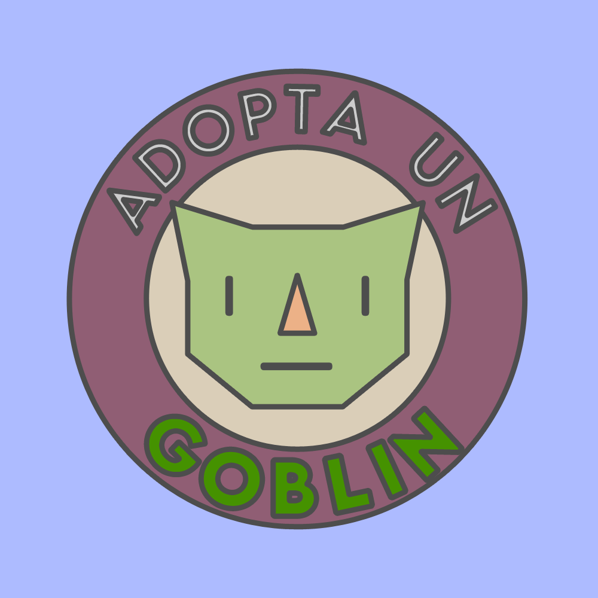

<h1 align="center">

 Adopta Un Goblin
</h1>

	<b><i>MalagaJam17 Game</i></b> 

## 💡 About the project
This project is the game presented in the MalagaJam17. 

## Deployment
This game has been created in Unity with C#.

You can play with this [link](https://quione28.itch.io/adopta-un-goblin).

## Authors
- [Juan Ariza](https://github.com/jariza-o)(Software Developer, accessibility, design support)
- [Marina Rodriguez](https://github.com/MofMiq)(Software Developer, animation)
- [Juande Pérez](https://github.com/jperez-j)(Game Designer, UI/UX graphic design)
- [Luh González](https://itch.io/profile/katastraa)(2D illustration, animation, character designer, SFX)
- [Ana Montenegro](https://quione28.itch.io/):(Narrative, script, music. SFX, graphic design)
- [Antonio J Armenteros](https://github.com/antjarm)(Software Developer)
